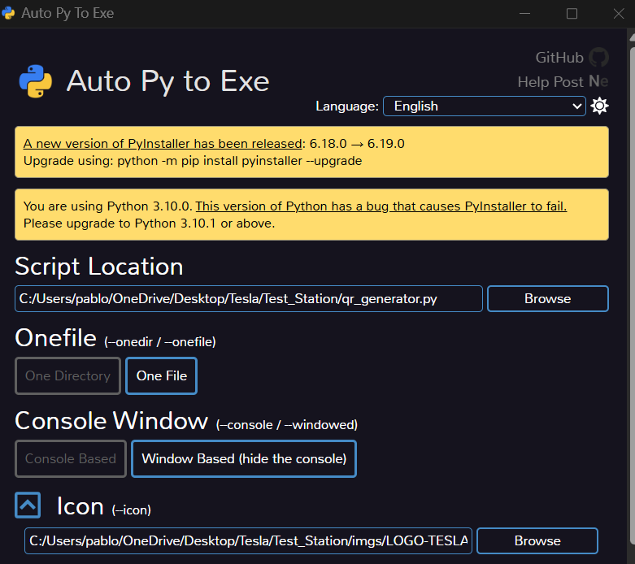
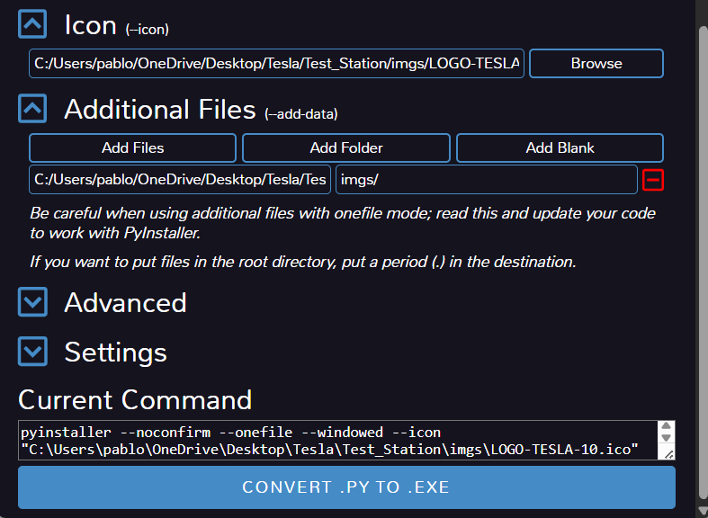

# Notas para desarrollo
## Como generar archivos .exe
Se pueden crear archivos .exe con la siguiente aplicacion de python [auto-py-to-exe](https://pypi.org/project/auto-py-to-exe/)
Contiene una interfaz simple en donde se puede parametrizar la salida del archivo 
### Instalacion
Usa este comando para instalarlo
``` bash
pip install auto-py-to-exe
```
Una vez instalado puedes activar la interfaz con el siguiente comando:

``` bash
auto-py-to-exe
```
Una vez iniciado la interfaz se deben seguir estos pasos

 1. Se debe elegir el archivo .py a convertir 
 2. Se selecciona en modo **One File** para computadoras sin Python env 
 3. Si el archivo esta programado como una GUI se debe elegir en modo **Window based** de lo contrario se puede poner en modo **Console Based**

<figure>
  
  <figcaption>Figura 1: Configuracion basica</figcaption>
</figure>

 4. Se añade el icono *(opcional)* 
 5. Se pueden añadir archivos o carpetas adicionales, segun sean necesarios para el programa

> Nota: se deben añadir todos los archivos secundarios que usa el
> programa

<figure>
  
  <figcaption>Figura 2: Configuracion de icono y archivos adicionales</figcaption>
</figure>

Finalmente el archivo .exe estara en la carpeta **output**
>Al ser un archivo **standalone** puede pesar varias megas y en la carpeta output solamente debe haber un archivo (si se eligio en modo One File)
